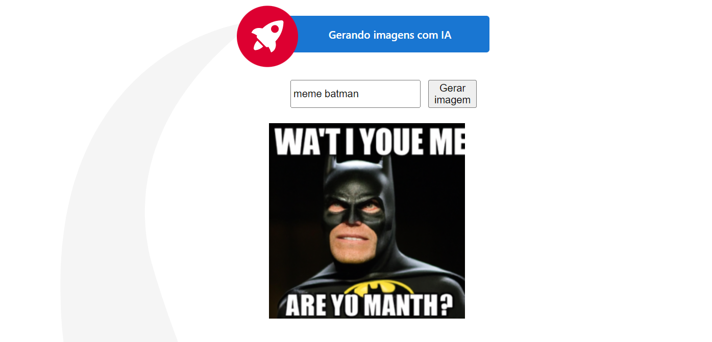

# NgIaGenerateImage

Projeto desenvolvido para gerar imagens utilizando DALLE - OpenAI.

## Development server

Para rodar o projeto execute os seguintes passos:

* `npm i` para baixar os pacotes;
* Crie uma chave e adicione nos environments do projeto [link para gerar a key](https://beta.openai.com/account/api-keys)
* `ng serve --open` para abrir o projeto no seu navegador

## Image generated by IA

